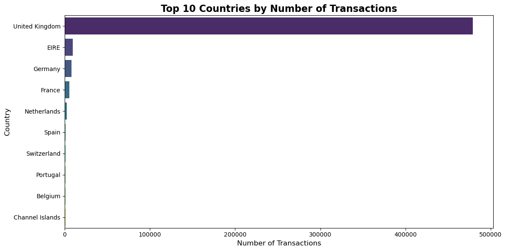
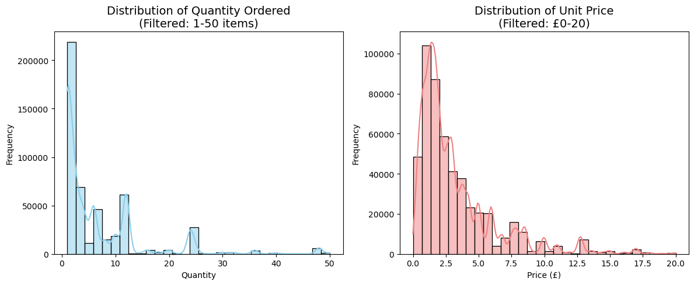
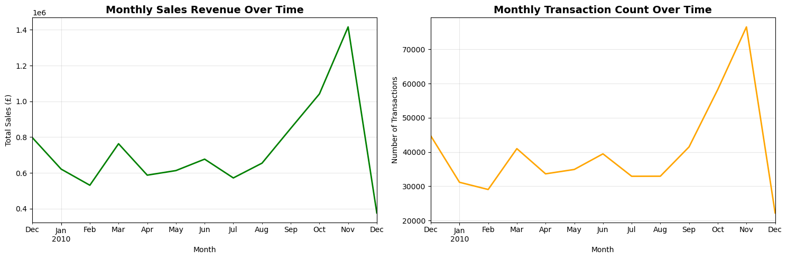
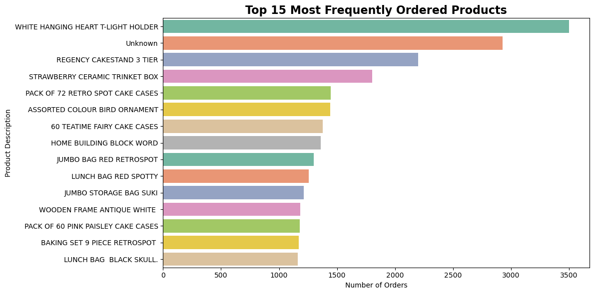
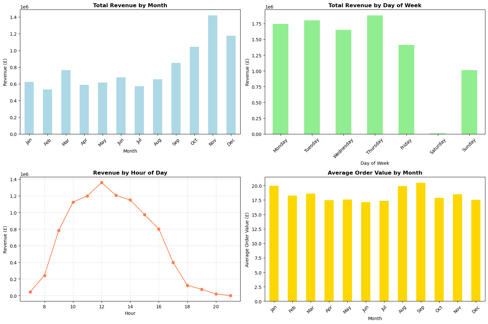
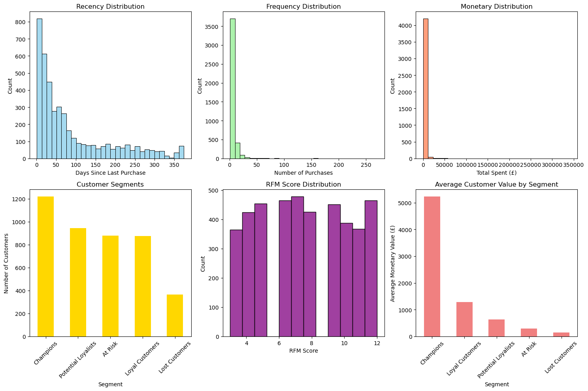

# Project: Advanced Data Analysis on Retail Sales Data

**Author:** Seakleng Ren

## Project Summary

This project analyzes the [Online Retail II dataset](https://archive.ics.uci.edu/dataset/502/online+retail+ii) to uncover sales trends, customer behavior, and actionable business insights. The workflow includes data cleaning, exploratory analysis, feature engineering, and advanced analytics such as customer segmentation.

**Dataset:** online_retail_II.xlsx  
[Link to the dataset](https://archive.ics.uci.edu/dataset/502/online+retail+ii)

---

## Table of Contents

1. [Data Cleaning & Preparation](#data-cleaning)
2. [Exploratory Data Analysis](#eda)
3. [Feature Engineering](#feature-engineering)
4. [Advanced Analytics (RFM Analysis)](#advanced-analytics)
5. [Conclusion](#conclusion)


<a id="data-cleaning"></a>
## 1. Data Cleaning & Preparation


```python
# Import necessary libraries
import pandas as pd
import numpy as np
import matplotlib.pyplot as plt
import seaborn as sns
import datetime as dt
import warnings
warnings.filterwarnings('ignore')

# Set plotting style
plt.style.use('default')
sns.set_palette("husl")

# Reading file "online_retail_II.xlsx"
df = pd.read_excel("online_retail_II.xlsx")
print(f"Dataset shape: {df.shape}")
df.head()
```

    Dataset shape: (525461, 8)
    


<div>
<style scoped>
    .dataframe tbody tr th:only-of-type {
        vertical-align: middle;
    }

    .dataframe tbody tr th {
        vertical-align: top;
    }

    .dataframe thead th {
        text-align: right;
    }
</style>
<table border="1" class="dataframe">
  <thead>
    <tr style="text-align: right;">
      <th></th>
      <th>Invoice</th>
      <th>StockCode</th>
      <th>Description</th>
      <th>Quantity</th>
      <th>InvoiceDate</th>
      <th>Price</th>
      <th>Customer ID</th>
      <th>Country</th>
    </tr>
  </thead>
  <tbody>
    <tr>
      <th>0</th>
      <td>489434</td>
      <td>85048</td>
      <td>15CM CHRISTMAS GLASS BALL 20 LIGHTS</td>
      <td>12</td>
      <td>2009-12-01 07:45:00</td>
      <td>6.95</td>
      <td>13085.0</td>
      <td>United Kingdom</td>
    </tr>
    <tr>
      <th>1</th>
      <td>489434</td>
      <td>79323P</td>
      <td>PINK CHERRY LIGHTS</td>
      <td>12</td>
      <td>2009-12-01 07:45:00</td>
      <td>6.75</td>
      <td>13085.0</td>
      <td>United Kingdom</td>
    </tr>
    <tr>
      <th>2</th>
      <td>489434</td>
      <td>79323W</td>
      <td>WHITE CHERRY LIGHTS</td>
      <td>12</td>
      <td>2009-12-01 07:45:00</td>
      <td>6.75</td>
      <td>13085.0</td>
      <td>United Kingdom</td>
    </tr>
    <tr>
      <th>3</th>
      <td>489434</td>
      <td>22041</td>
      <td>RECORD FRAME 7" SINGLE SIZE</td>
      <td>48</td>
      <td>2009-12-01 07:45:00</td>
      <td>2.10</td>
      <td>13085.0</td>
      <td>United Kingdom</td>
    </tr>
    <tr>
      <th>4</th>
      <td>489434</td>
      <td>21232</td>
      <td>STRAWBERRY CERAMIC TRINKET BOX</td>
      <td>24</td>
      <td>2009-12-01 07:45:00</td>
      <td>1.25</td>
      <td>13085.0</td>
      <td>United Kingdom</td>
    </tr>
  </tbody>
</table>
</div>


```python
# Check basic info about the dataset
print("Dataset Info:")
print(f"Shape: {df.shape}")
print(f"\nData types:")
print(df.dtypes)
print(f"\nMemory usage: {df.memory_usage(deep=True).sum() / 1024**2:.2f} MB")
```

    Dataset Info:
    Shape: (525461, 8)
    
    Data types:
    Invoice                object
    StockCode              object
    Description            object
    Quantity                int64
    InvoiceDate    datetime64[ns]
    Price                 float64
    Customer ID           float64
    Country                object
    dtype: object
    
    Memory usage: 122.87 MB
    


```python
# Check for missing values
missing_values = df.isnull().sum()
print("Missing values per column:")
print(missing_values)
print(f"\nTotal missing values: {missing_values.sum()}")
print(f"Percentage of missing values: {(missing_values.sum() / len(df)) * 100:.2f}%")
```

    Missing values per column:
    Invoice             0
    StockCode           0
    Description      2928
    Quantity            0
    InvoiceDate         0
    Price               0
    Customer ID    107927
    Country             0
    dtype: int64
    
    Total missing values: 110855
    Percentage of missing values: 21.10%
    


```python
# Handle missing values
print("Before handling missing values:")
print(f"Description missing: {df['Description'].isnull().sum()}")
print(f"Customer ID missing: {df['Customer ID'].isnull().sum()}")

# Replace missing values
df['Description'] = df['Description'].fillna('Unknown')
df['Customer ID'] = df['Customer ID'].fillna(0)

print("\nAfter handling missing values:")
print(f"Description 'Unknown': {(df['Description'] == 'Unknown').sum()}")
print(f"Customer ID = 0: {(df['Customer ID'] == 0).sum()}")
```

    Before handling missing values:
    Description missing: 2928
    Customer ID missing: 107927
    
    After handling missing values:
    Description 'Unknown': 2928
    Customer ID = 0: 107927
    


```python
# Check for duplicate rows
duplicates_count = df.duplicated().sum()
print(f"Number of duplicate rows: {duplicates_count}")

if duplicates_count > 0:
    df = df.drop_duplicates()
    print(f"After removing duplicates: {df.shape}")
else:
    print("No duplicates found.")
```

    Number of duplicate rows: 6865
    After removing duplicates: (518596, 8)
    


```python
# Examine country distribution
print("Top 10 countries by transaction count:")
country_counts = df['Country'].value_counts()
print(country_counts.head(10))

# Remove 'Unspecified' entries if they exist
if 'Unspecified' in df['Country'].values:
    unspecified_count = (df['Country'] == 'Unspecified').sum()
    print(f"\nRemoving {unspecified_count} 'Unspecified' entries")
    df = df[df['Country'] != 'Unspecified']
    print(f"Final dataset shape: {df.shape}")
```

    Top 10 countries by transaction count:
    Country
    United Kingdom     479047
    EIRE                 9660
    Germany              8120
    France               5754
    Netherlands          2768
    Spain                1271
    Switzerland          1187
    Portugal             1098
    Belgium              1053
    Channel Islands       906
    Name: count, dtype: int64
    
    Removing 310 'Unspecified' entries
    Final dataset shape: (518286, 8)
    


```python
# Check for data quality issues
print("Data Quality Checks:")
print(f"Negative quantities: {(df['Quantity'] < 0).sum()}")
print(f"Zero quantities: {(df['Quantity'] == 0).sum()}")
print(f"Negative prices: {(df['Price'] < 0).sum()}")
print(f"Zero prices: {(df['Price'] == 0).sum()}")

# Basic statistics
print("\nBasic Statistics:")
print(df[['Quantity', 'Price']].describe())
```

    Data Quality Checks:
    Negative quantities: 12298
    Zero quantities: 0
    Negative prices: 3
    Zero prices: 3681
    
    Basic Statistics:
                Quantity          Price
    count  518286.000000  518286.000000
    mean       10.437805       4.714728
    std       108.158557     147.125203
    min     -9600.000000  -53594.360000
    25%         1.000000       1.250000
    50%         3.000000       2.100000
    75%        10.000000       4.210000
    max     19152.000000   25111.090000
    

### Data Cleaning Summary

**Key cleaning steps performed:**
- Handled missing values in Description (filled with 'Unknown') and Customer ID (filled with 0)
- Removed duplicate rows to ensure data integrity
- Filtered out 'Unspecified' country entries for cleaner geographic analysis
- Identified potential data quality issues (negative quantities/prices may indicate returns)

**Final dataset:** Clean and ready for analysis with improved data quality.

<a id="eda"></a>
## 2. Exploratory Data Analysis


```python
# Top 10 countries by number of transactions
plt.figure(figsize=(12, 6))
top_countries = df['Country'].value_counts().head(10)
sns.barplot(x=top_countries.values, y=top_countries.index, palette='viridis')
plt.title('Top 10 Countries by Number of Transactions', fontsize=16, fontweight='bold')
plt.xlabel('Number of Transactions', fontsize=12)
plt.ylabel('Country', fontsize=12)
plt.tight_layout()
plt.show()

print(f"UK represents {(top_countries.iloc[0] / df.shape[0]) * 100:.1f}% of all transactions")
```


    

    


    UK represents 92.4% of all transactions
    


```python
# Distribution of Quantity (filtered for better visualization)
plt.figure(figsize=(12, 5))

plt.subplot(1, 2, 1)
# Filter extreme outliers for better visualization
quantity_filtered = df[(df['Quantity'] > 0) & (df['Quantity'] <= 50)]['Quantity']
sns.histplot(quantity_filtered, bins=30, kde=True, color='skyblue')
plt.title('Distribution of Quantity Ordered\n(Filtered: 1-50 items)', fontsize=14)
plt.xlabel('Quantity')
plt.ylabel('Frequency')

plt.subplot(1, 2, 2)
# Price distribution (filtered)
price_filtered = df[(df['Price'] > 0) & (df['Price'] <= 20)]['Price']
sns.histplot(price_filtered, bins=30, kde=True, color='lightcoral')
plt.title('Distribution of Unit Price\n(Filtered: £0-20)', fontsize=14)
plt.xlabel('Price (£)')
plt.ylabel('Frequency')

plt.tight_layout()
plt.show()
```


    

    


```python
# Sales trends over time
df['InvoiceDate'] = pd.to_datetime(df['InvoiceDate'])
df_temp = df.copy()
df_temp.set_index('InvoiceDate', inplace=True)

# Create TotalPrice for time series analysis
df_temp['TotalPrice'] = df_temp['Quantity'] * df_temp['Price']

# Monthly sales
monthly_sales = df_temp.resample('M')['TotalPrice'].sum()
monthly_transactions = df_temp.resample('M').size()

plt.figure(figsize=(15, 5))

plt.subplot(1, 2, 1)
monthly_sales.plot(color='green', linewidth=2)
plt.title('Monthly Sales Revenue Over Time', fontsize=14, fontweight='bold')
plt.ylabel('Total Sales (£)')
plt.xlabel('Month')
plt.grid(True, alpha=0.3)

plt.subplot(1, 2, 2)
monthly_transactions.plot(color='orange', linewidth=2)
plt.title('Monthly Transaction Count Over Time', fontsize=14, fontweight='bold')
plt.ylabel('Number of Transactions')
plt.xlabel('Month')
plt.grid(True, alpha=0.3)

plt.tight_layout()
plt.show()

# Reset index for further analysis
df_temp.reset_index(inplace=True)
```


    

    


```python
# Top selling products
plt.figure(figsize=(12, 6))
top_products = df['Description'].value_counts().head(15)
sns.barplot(x=top_products.values, y=top_products.index, palette='Set2')
plt.title('Top 15 Most Frequently Ordered Products', fontsize=16, fontweight='bold')
plt.xlabel('Number of Orders')
plt.ylabel('Product Description')
plt.tight_layout()
plt.show()
```


    

    


### EDA Key Insights

**Geographic Distribution:**
- The UK dominates with ~92% of all transactions, indicating a primarily UK-focused business
- European countries (Germany, France, EIRE) represent the next largest markets

**Product & Pricing Patterns:**
- Most orders are for small quantities (1-10 items), typical of retail purchases
- Unit prices are generally low (under £5), suggesting affordable consumer goods
- Clear seasonality in sales with peaks during certain months

**Business Implications:**
- Strong UK market presence provides stable revenue base
- Opportunity to expand in European markets
- Seasonal patterns can inform inventory and marketing strategies

<a id="feature-engineering"></a>
## 3. Feature Engineering


```python
# Create new features
print("Creating new features...")

# Total price per transaction line
df['TotalPrice'] = df['Quantity'] * df['Price']

# Time-based features
df['InvoiceMonth'] = df['InvoiceDate'].dt.month
df['InvoiceDayOfWeek'] = df['InvoiceDate'].dt.dayofweek
df['InvoiceHour'] = df['InvoiceDate'].dt.hour
df['InvoiceYear'] = df['InvoiceDate'].dt.year

# Day of week names for better interpretation
day_names = {0: 'Monday', 1: 'Tuesday', 2: 'Wednesday', 3: 'Thursday', 
             4: 'Friday', 5: 'Saturday', 6: 'Sunday'}
df['DayName'] = df['InvoiceDayOfWeek'].map(day_names)

# Month names
month_names = {1: 'Jan', 2: 'Feb', 3: 'Mar', 4: 'Apr', 5: 'May', 6: 'Jun',
               7: 'Jul', 8: 'Aug', 9: 'Sep', 10: 'Oct', 11: 'Nov', 12: 'Dec'}
df['MonthName'] = df['InvoiceMonth'].map(month_names)

print("New features created:")
print("- TotalPrice: Quantity × Price")
print("- Time features: Month, Day of Week, Hour, Year")
print(f"\nDataset shape after feature engineering: {df.shape}")
```

    Creating new features...
    New features created:
    - TotalPrice: Quantity × Price
    - Time features: Month, Day of Week, Hour, Year
    
    Dataset shape after feature engineering: (518286, 15)
    


```python
# Analyze patterns by time features
plt.figure(figsize=(15, 10))

# Sales by month
plt.subplot(2, 2, 1)
monthly_revenue = df.groupby('MonthName')['TotalPrice'].sum().reindex(
    ['Jan', 'Feb', 'Mar', 'Apr', 'May', 'Jun', 'Jul', 'Aug', 'Sep', 'Oct', 'Nov', 'Dec']
)
monthly_revenue.plot(kind='bar', color='lightblue')
plt.title('Total Revenue by Month', fontweight='bold')
plt.xlabel('Month')
plt.ylabel('Revenue (£)')
plt.xticks(rotation=45)

# Sales by day of week
plt.subplot(2, 2, 2)
daily_revenue = df.groupby('DayName')['TotalPrice'].sum().reindex(
    ['Monday', 'Tuesday', 'Wednesday', 'Thursday', 'Friday', 'Saturday', 'Sunday']
)
daily_revenue.plot(kind='bar', color='lightgreen')
plt.title('Total Revenue by Day of Week', fontweight='bold')
plt.xlabel('Day of Week')
plt.ylabel('Revenue (£)')
plt.xticks(rotation=45)

# Sales by hour
plt.subplot(2, 2, 3)
hourly_revenue = df.groupby('InvoiceHour')['TotalPrice'].sum()
hourly_revenue.plot(kind='line', marker='o', color='coral')
plt.title('Revenue by Hour of Day', fontweight='bold')
plt.xlabel('Hour')
plt.ylabel('Revenue (£)')
plt.grid(True, alpha=0.3)

# Average order value by month
plt.subplot(2, 2, 4)
monthly_avg = df.groupby('MonthName')['TotalPrice'].mean().reindex(
    ['Jan', 'Feb', 'Mar', 'Apr', 'May', 'Jun', 'Jul', 'Aug', 'Sep', 'Oct', 'Nov', 'Dec']
)
monthly_avg.plot(kind='bar', color='gold')
plt.title('Average Order Value by Month', fontweight='bold')
plt.xlabel('Month')
plt.ylabel('Average Order Value (£)')
plt.xticks(rotation=45)

plt.tight_layout()
plt.show()
```


    

    


### Feature Engineering Insights

**Temporal Patterns:**
- **Seasonality:** Clear peaks in certain months, likely driven by holiday shopping
- **Weekly patterns:** Business days show different patterns than weekends
- **Daily patterns:** Peak hours align with typical business/shopping hours

**Business Value:**
- These features enable time-based analysis and forecasting
- Can inform staffing, inventory, and marketing decisions
- Help identify optimal times for promotions and campaigns

<a id="advanced-analytics"></a>
## 4. Advanced Analytics: RFM Analysis


```python
# RFM Analysis - Customer Segmentation
print("Performing RFM Analysis...")

# Filter out customers with ID = 0 (missing customer data)
df_customers = df[df['Customer ID'] != 0].copy()
print(f"Analyzing {df_customers['Customer ID'].nunique()} unique customers")

# Reference date for recency calculation
snapshot_date = df_customers['InvoiceDate'].max() + dt.timedelta(days=1)
print(f"Reference date for recency: {snapshot_date.date()}")

# Calculate RFM metrics
rfm = df_customers.groupby('Customer ID').agg({
    'InvoiceDate': lambda x: (snapshot_date - x.max()).days,  # Recency
    'Invoice': 'nunique',  # Frequency
    'TotalPrice': 'sum'    # Monetary
})

rfm.rename(columns={
    'InvoiceDate': 'Recency',
    'Invoice': 'Frequency', 
    'TotalPrice': 'Monetary'
}, inplace=True)

# Remove customers with negative monetary value (returns only)
rfm = rfm[rfm['Monetary'] > 0]

print(f"\nRFM Summary Statistics:")
print(rfm.describe())
```

    Performing RFM Analysis...
    Analyzing 4378 unique customers
    Reference date for recency: 2010-12-10
    
    RFM Summary Statistics:
               Recency    Frequency      Monetary
    count  4279.000000  4279.000000  4.279000e+03
    mean     88.489367     5.457350  1.964185e+03
    std      95.685394    10.151862  8.597077e+03
    min       1.000000     1.000000  8.881784e-16
    25%      17.000000     1.000000  3.012550e+02
    50%      50.000000     3.000000  6.794400e+02
    75%     130.000000     6.000000  1.676590e+03
    max     374.000000   270.000000  3.417767e+05
    


```python
# Create RFM scores using quartiles
rfm['R_Score'] = pd.qcut(rfm['Recency'], 4, labels=[4,3,2,1])  # Lower recency = higher score
rfm['F_Score'] = pd.qcut(rfm['Frequency'].rank(method='first'), 4, labels=[1,2,3,4])  # Higher frequency = higher score
rfm['M_Score'] = pd.qcut(rfm['Monetary'], 4, labels=[1,2,3,4])  # Higher monetary = higher score

# Create RFM segment and overall score
rfm['RFM_Segment'] = rfm['R_Score'].astype(str) + rfm['F_Score'].astype(str) + rfm['M_Score'].astype(str)
rfm['RFM_Score'] = rfm[['R_Score','F_Score','M_Score']].sum(axis=1)

# Define customer segments based on RFM scores
def segment_customers(row):
    if row['RFM_Score'] >= 10:
        return 'Champions'
    elif row['RFM_Score'] >= 8:
        return 'Loyal Customers'
    elif row['RFM_Score'] >= 6:
        return 'Potential Loyalists'
    elif row['RFM_Score'] >= 4:
        return 'At Risk'
    else:
        return 'Lost Customers'

rfm['Customer_Segment'] = rfm.apply(segment_customers, axis=1)

print("Customer Segmentation Results:")
segment_counts = rfm['Customer_Segment'].value_counts()
print(segment_counts)
print(f"\nSegment Distribution:")
for segment, count in segment_counts.items():
    percentage = (count / len(rfm)) * 100
    print(f"{segment}: {count} customers ({percentage:.1f}%)")
```

    Customer Segmentation Results:
    Customer_Segment
    Champions              1219
    Potential Loyalists     942
    At Risk                 878
    Loyal Customers         876
    Lost Customers          364
    Name: count, dtype: int64
    
    Segment Distribution:
    Champions: 1219 customers (28.5%)
    Potential Loyalists: 942 customers (22.0%)
    At Risk: 878 customers (20.5%)
    Loyal Customers: 876 customers (20.5%)
    Lost Customers: 364 customers (8.5%)
    


```python
# Visualize RFM Analysis
plt.figure(figsize=(15, 10))

# RFM Distribution
plt.subplot(2, 3, 1)
sns.histplot(rfm['Recency'], bins=30, color='skyblue')
plt.title('Recency Distribution')
plt.xlabel('Days Since Last Purchase')

plt.subplot(2, 3, 2)
sns.histplot(rfm['Frequency'], bins=30, color='lightgreen')
plt.title('Frequency Distribution')
plt.xlabel('Number of Purchases')

plt.subplot(2, 3, 3)
sns.histplot(rfm['Monetary'], bins=30, color='coral')
plt.title('Monetary Distribution')
plt.xlabel('Total Spent (£)')

# Customer Segments
plt.subplot(2, 3, 4)
segment_counts.plot(kind='bar', color='gold')
plt.title('Customer Segments')
plt.xlabel('Segment')
plt.ylabel('Number of Customers')
plt.xticks(rotation=45)

# RFM Score Distribution
plt.subplot(2, 3, 5)
sns.histplot(rfm['RFM_Score'], bins=12, color='purple')
plt.title('RFM Score Distribution')
plt.xlabel('RFM Score')

# Segment Value Analysis
plt.subplot(2, 3, 6)
segment_value = rfm.groupby('Customer_Segment')['Monetary'].mean().sort_values(ascending=False)
segment_value.plot(kind='bar', color='lightcoral')
plt.title('Average Customer Value by Segment')
plt.xlabel('Segment')
plt.ylabel('Average Monetary Value (£)')
plt.xticks(rotation=45)

plt.tight_layout()
plt.show()
```


    

    


```python
# Top customers analysis
print("=== TOP 10 CUSTOMERS BY RFM SCORE ===")
top_customers = rfm.sort_values('RFM_Score', ascending=False).head(10)
print(top_customers[['Recency', 'Frequency', 'Monetary', 'RFM_Score', 'Customer_Segment']])

print("\n=== SEGMENT ANALYSIS ===")
segment_analysis = rfm.groupby('Customer_Segment').agg({
    'Recency': 'mean',
    'Frequency': 'mean', 
    'Monetary': ['mean', 'sum'],
    'RFM_Score': 'mean'
}).round(2)

print(segment_analysis)
```

    === TOP 10 CUSTOMERS BY RFM SCORE ===
                 Recency  Frequency  Monetary  RFM_Score Customer_Segment
    Customer ID                                                          
    15898.0            3         25   4071.51         12        Champions
    16316.0           16          7   2777.75         12        Champions
    17428.0            4         19  14159.61         12        Champions
    13488.0            3         13   6603.12         12        Champions
    13491.0            8         18   3350.74         12        Champions
    17442.0            1         14   2290.44         12        Champions
    13495.0            2          9   3256.49         12        Champions
    13126.0            2         11   1846.18         12        Champions
    17450.0            3          8  46097.22         12        Champions
    16327.0            5         15   6849.15         12        Champions
    
    === SEGMENT ANALYSIS ===
                        Recency Frequency Monetary             RFM_Score
                           mean      mean     mean         sum      mean
    Customer_Segment                                                    
    At Risk              156.45      1.40   299.72   263157.29      4.52
    Champions             20.11     12.96  5229.39  6374627.23     11.06
    Lost Customers       253.60      1.00   151.07    54990.26      3.00
    Loyal Customers       51.35      4.24  1277.97  1119499.31      8.51
    Potential Loyalists   84.37      2.38   628.95   592475.54      6.51
    

### RFM Analysis Insights

**Customer Segmentation Results:**

1. **Champions** (RFM Score ≥ 10): Your best customers who buy frequently, recently, and spend the most
   - *Strategy*: Reward them, ask for reviews, upsell premium products

2. **Loyal Customers** (RFM Score 8-9): Good customers who are responsive to promotions
   - *Strategy*: Recommend other products, loyalty programs

3. **Potential Loyalists** (RFM Score 6-7): Recent customers with average frequency
   - *Strategy*: Membership programs, special offers to increase frequency

4. **At Risk** (RFM Score 4-5): Customers who used to purchase frequently but haven't returned
   - *Strategy*: Win-back campaigns, special discounts

5. **Lost Customers** (RFM Score < 4): Lowest recency, frequency, and monetary scores
   - *Strategy*: Aggressive win-back campaigns or ignore if cost-prohibitive

**Business Impact:**
- Focus marketing budget on Champions and Loyal Customers for highest ROI
- Develop targeted retention strategies for At Risk customers
- Create acquisition strategies to convert Potential Loyalists

<a id="conclusion"></a>
## 5. Conclusion

## Key Findings & Business Insights

### 📊 **Market Analysis**
- **Geographic Concentration**: UK dominates with ~92% of transactions, indicating strong domestic market presence
- **European Opportunity**: Germany, France, and Ireland represent growth opportunities
- **Product Portfolio**: Focus on affordable consumer goods (average price £2-5)

### 📈 **Sales Patterns**
- **Seasonality**: Clear seasonal trends with holiday peaks
- **Purchase Behavior**: Most customers buy small quantities (1-10 items) frequently
- **Timing**: Business hours show peak activity, weekday patterns differ from weekends

### 👥 **Customer Segmentation (RFM Analysis)**
- **Champions**: High-value customers requiring VIP treatment and retention focus
- **At Risk**: Significant portion needs immediate win-back strategies
- **Growth Potential**: Potential Loyalists segment offers conversion opportunities

---

## 🎯 **Strategic Recommendations**

### **Immediate Actions (0-3 months)**
1. **Customer Retention**: Launch win-back campaigns for "At Risk" customers
2. **VIP Program**: Create exclusive benefits for Champions and Loyal Customers
3. **Seasonal Planning**: Prepare inventory and marketing for identified peak seasons

### **Medium-term Initiatives (3-12 months)**
1. **Market Expansion**: Develop targeted strategies for European markets
2. **Product Development**: Focus on products that drive higher order values
3. **Personalization**: Use RFM segments for targeted marketing campaigns

### **Long-term Strategy (12+ months)**
1. **Predictive Analytics**: Implement churn prediction and lifetime value models
2. **Market Basket Analysis**: Develop cross-selling and upselling strategies
3. **International Expansion**: Scale successful European strategies globally


